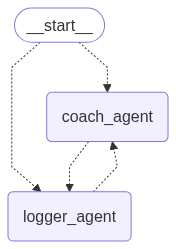

# Pili - Exercise Tracker Chatbot Microservice

A sophisticated chatbot microservice named **Pili** for an exercise tracker application, built with FastAPI, LangGraph, and LangSmith. Features a **3-agent orchestration architecture** with **intelligent routing** and **MCP server integration** for the Scaffold Your Shape fitness platform.

## 🏗️ Architecture

### 3-Agent Orchestration System



### File Structure
```
├── agents/
│   ├── agent.py                # Main orchestration system and agent creation
│   ├── prompts.py              # Agent prompts including orchestration logic
│   └── utils.py                # Utility functions for agents
├── tools/            # Legacy API tools (kept for compatibility)
├── services/         # LLM and external service integrations
├── models/           # Pydantic data models for API and chat
├── config/           # Configuration and settings
├── core/             # Orchestration-based chat handling
└── main.py           # FastAPI application entry point
```

## 🚀 Features

### 🎯 Orchestration Agent (Primary)
- **Intelligent Request Routing**: Analyzes user intent and routes to appropriate specialized agents
- **Concise Few-Shot Learning**: Uses minimal, optimal prompts with clear routing examples
- **Friendly Response Generation**: Maintains Pili's warm personality throughout interactions
- **Efficient Agent Coordination**: Seamlessly coordinates between Logger and Coach agents

### 📝 Logger Agent (MCP Integration)
- **Direct MCP Server Connection**: Communicates with Scaffold Your Shape at `192.168.1.98:3005`
- **Activity Logging**: Real-time workout tracking to the main application
- **Club Management**: Join/leave fitness clubs via MCP server
- **Progress Retrieval**: Fetches user activity history for analysis

### 🏃‍♀️ Coach Agent (AI-Powered)
- **Personalized Workout Planning**: Creates custom exercise routines
- **Progress Analysis**: Data-driven insights and trend analysis
- **Motivational Coaching**: Encouraging messages and goal-setting
- **Performance Optimization**: Suggests improvements based on activity patterns

### 🌟 Additional Features
- **Conversation Memory**: Maintains context across interactions
- **Real-time Streaming**: Supports streaming responses with orchestration metadata
- **Robust Error Handling**: Graceful fallbacks for all components
- **Auto-generated API Documentation**: Interactive Swagger UI

## 🛠️ Setup

1. **Clone and navigate to the project:**
   ```bash
   git clone <repository-url>
   cd exercise-tracker-chatbot
   ```

2. **Install dependencies:**
   ```bash
   pip install -r requirements.txt
   ```

3. **Configure environment:**
   ```bash
   cp .env.sample .env
   # Edit .env with your actual values
   ```

4. **Run the server:**
   ```bash
   uvicorn main:app --reload
   ```

5. **Access the API docs:**
   - Open [http://localhost:8000/api/docs](http://localhost:8000/api/docs)

## 🔧 Configuration

Set the following environment variables in your `.env` file:

- `LANGCHAIN_API_KEY`: Your LangChain API key for LangSmith
- `LANGCHAIN_PROJECT`: Project name for LangSmith tracking (default: pili-exercise-chatbot)
- `LLM_PROVIDER`: LLM provider (openai, ollama, vllm, local)
- `OPENAI_API_KEY`: OpenAI API key (if using OpenAI)
- `LOCAL_LLM_BASE_URL`: Local LLM base URL (default: http://localhost:11434)
- `LOCAL_LLM_MODEL`: Local LLM model name (default: llama2)
- `MCP_BASE_URL`: Scaffold Your Shape MCP server URL (default: http://192.168.1.98:3005/api/mcp)

### MCP Server Configuration

The Logger and Coach agents connect to the Scaffold Your Shape MCP server:
- **MCP Server URL**: Configurable via `MCP_BASE_URL` environment variable (default: `http://192.168.1.98:3005/api/mcp`)
- **Protocol**: HTTP POST with JSON payloads using proper MCP methods (`tools/list`, `tools/call`, `resources/list`)
- **Timeout**: 30 seconds
- **Methods**: Dynamic tool discovery from MCP server at runtime

## 📝 API Endpoints

### POST `/api/chat`
Main chat endpoint for interacting with Pili.

**Request:**
```json
{
  "user_id": "user123",
  "message": "I ran 5 km in 30 minutes today"
}
```

**Response:**
```json
{
  "response": "Great job! I've logged your Running activity - 5.0 km, 30 minutes.",
  "logs": []
}
```

### GET `/api/health`
Health check endpoint.

### GET `/api/docs`
Redirects to Swagger UI documentation.

## 🤖 How the 3-Agent Orchestration System Works

### Simple Request Flow
```
User: "I ran 5 km this morning"
   ↓
🎯 Orchestration Agent: "Direct logging task → Route to Logger Agent"
   ↓
📝 Logger Agent: Logs to MCP server → "Activity logged successfully"
   ↓
🎯 Orchestration Agent: Returns friendly response
   ↓
Response: "🎉 Great job! I've logged your Running activity - 5 km in Scaffold Your Shape!"
```

### Complex Request Flow
```
User: "I want to improve my running and need a training plan"
   ↓
🎯 Orchestration Agent: "Complex task → Route to Logger + Coach agents"
   ↓
📝 Logger Agent: Gets running history from MCP server
🏃‍♀️ Coach Agent: Analyzes data + creates personalized plan
   ↓
🎯 Orchestration Agent: Combines results with friendly response
   ↓
Response: Comprehensive training plan with current progress context
```

## 🤖 What Pili Can Do

| Category | Example Messages | Agent Flow |
|----------|------------------|------------|
| **Activity Logging** | "I ran 5 km", "Did yoga for 45 minutes" | Orchestration → Logger → MCP Server |
| **Club Management** | "Show me clubs", "Join club runners" | Orchestration → Logger → MCP Server |
| **Workout Planning** | "Create a running plan", "I need a training schedule" | Orchestration → Logger (data) + Coach (planning) |
| **Progress Analysis** | "How am I doing?", "Analyze my progress" | Orchestration → Logger (data) + Coach (analysis) |
| **Motivation** | "I need motivation", "Encourage me" | Orchestration → Coach with context |
| **Memory & Context** | "How did my run go yesterday?", "Continue my training plan" | Memory-aware responses using conversation history |

## 🧠 Memory System

Pili now includes a comprehensive memory system that maintains conversation history for each user:

### Features
- **Per-User Memory**: Each user has separate conversation history
- **Session Support**: Multiple conversation sessions per user (e.g., workout planning vs. nutrition)
- **LangChain Integration**: Uses LangChain's robust memory capabilities
- **Persistent Storage**: Conversations stored to disk and survive server restarts
- **Context-Aware Agents**: Agents reference previous conversations for personalized responses

### Memory Types
- **Buffer Window** (Default): Keeps last 20 conversation exchanges
- **Summary Buffer**: Summarizes older conversations, keeps recent ones
- **Entity Memory**: Tracks entities mentioned (people, exercises, goals)
- **Full Buffer**: Keeps complete conversation history

### Memory Management API
```bash
# Get user memory stats
GET /api/memory/stats/{user_id}

# Clear user memory
POST /api/memory/clear
{"user_id": "user123", "session_id": "optional"}

# Search conversation history
POST /api/memory/search
{"user_id": "user123", "query": "running"}

# Get conversation history
GET /api/memory/conversation/{user_id}?session_id=default&limit=50
```

## 🧠 Pili's Intelligence

Pili uses advanced natural language processing to:

1. **Smart Activity Parsing**: Understands various ways to describe workouts
   - "I ran 3 miles" → Converts to kilometers and logs properly
   - "30 minute bike ride at Central Park" → Extracts duration, activity, and location

2. **Context-Aware Responses**: Provides personalized feedback based on user history

3. **Multi-Intent Handling**: Can process complex requests like "Show my running stats from this month"

## 🔌 Scaffold Your Shape API Integration

Pili integrates seamlessly with the Scaffold Your Shape platform:

**Activities Endpoint**: `POST /activities`
- Logs workouts with full activity details
- Supports all activity types (running, cycling, swimming, etc.)

**Clubs Endpoint**: `GET/POST /clubs`
- Browse and create fitness communities
- Join clubs with shared interests

**Challenges Endpoint**: `GET/POST /challenges`
- Participate in fitness challenges
- Create custom challenges with targets and timelines

**Authentication**: Session-based authentication using NextAuth.js tokens

## 📊 LangSmith Integration

Monitor Pili's conversations and performance:
- Intent detection accuracy
- User interaction patterns
- Response quality metrics
- Conversation flow analysis

## 🧪 Development

The project follows a modular 3-agent architecture for easy extension:

**Adding New Capabilities to Logger Agent:**
```python
# In agents/logger_agent.py
async def _new_mcp_method(self, user_id: str, message: str) -> str:
    mcp_request = {
        "method": "new_method",
        "params": {"user_id": user_id, "data": parsed_data}
    }
    # Handle MCP server communication
```

**Adding New Coaching Features:**
```python
# In agents/coach_agent.py
async def _new_coaching_feature(self, user_id: str, message: str) -> str:
    # Get user data via MCP
    activity_data = await self._get_user_activity_data(user_id)
    # Provide coaching logic
```

**Extending Orchestration Logic:**
```python
# In agents/orchestration_agent.py
# Modify analyze_task() to handle new complex scenarios
# Add new agent coordination patterns
```

## 📖 Documentation

For detailed technical documentation, see:
- [Agent Architecture Documentation](docs/agent-architecture.md)
- [Chain of Thought Implementation](docs/agent-architecture.md#chain-of-thought-implementation)
- [MCP Server Integration](docs/agent-architecture.md#mcp-server-integration)

## 📄 License

MIT License

---

**Meet Pili** - Your friendly AI fitness companion that makes tracking workouts as easy as having a conversation! 🏃‍♀️💪
